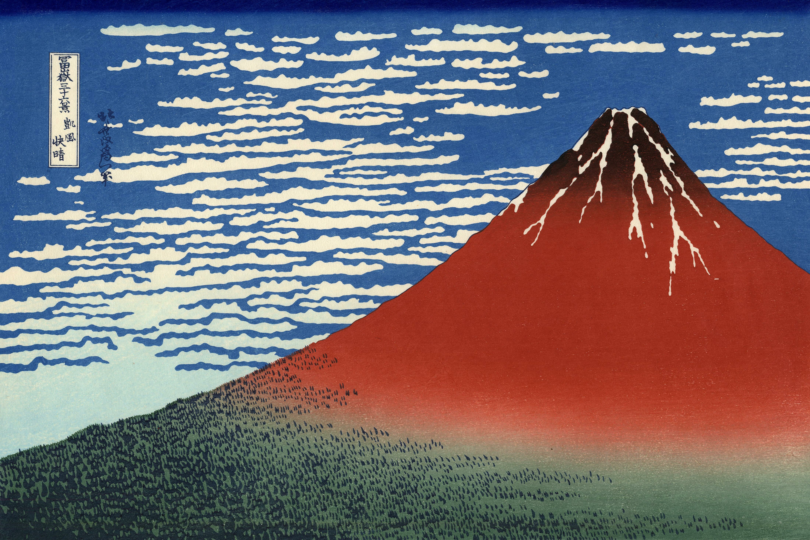

# 2. Красная Фудзи (Red Fuji)

## Варианты названия

- *"Красная Фудзи"*
- *"Red Fuji"*
- *"South Wind, Clear Sky"*
- *"Gaifu kaisei"*

## Описание

- **Размер:** 24.4 см × 35.6 см
- **Где можно увидеть:**
  - Музей Метрополитен (The Met), Нью-Йорк, США
  - Музей Хокусая в Сумиде (Sumida Hokusai Museum), Токио, Япония
  - Токийский национальный музей (Tokyo National Museum), Токио, Япония
  - Художественный музей Ота (Ota Memorial Museum of Art), Токио, Япония
  - Британский музей (British Museum), Лондон, Великобритания
  - Музей изящных искусств (MFA), Бостон, США

Гора Фудзи ранней осенью или поздним летом. В ясный день, когда южный ветер приносит сухой воздух, Фудзи приобретает ярко-красный оттенок. Этот эффект достигается благодаря тому, что солнечный свет отражается от красной глины, покрывающей гору. Картина символизирует силу и красоту природы, а также её изменчивость в зависимости от времени года и погодных условий.
