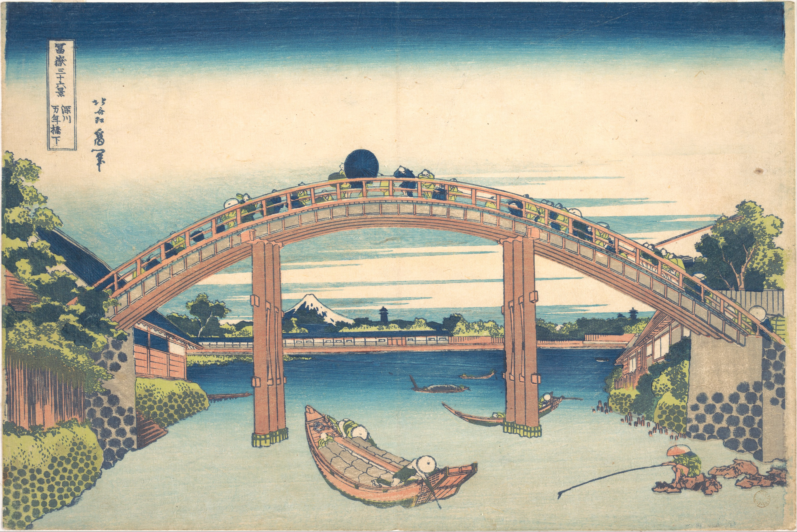

# 4. Under Mannen Bridge at Fukagawa

## Варианты названия

- *"Под мостом Маннен в Фукагава"*
- *"Under Mannen Bridge at Fukagawa"*
- *"Fukagawa Mannen-bashi shita"*

## Описание

На отпечатке изображены различные рыбацкие и торговые сцены под мостом, передающие аграрную и торговую атмосферу Фукагава, района Токио XIX века. Вдали под мостом видна гора Фудзи с заснеженной вершиной — символ Японии.
