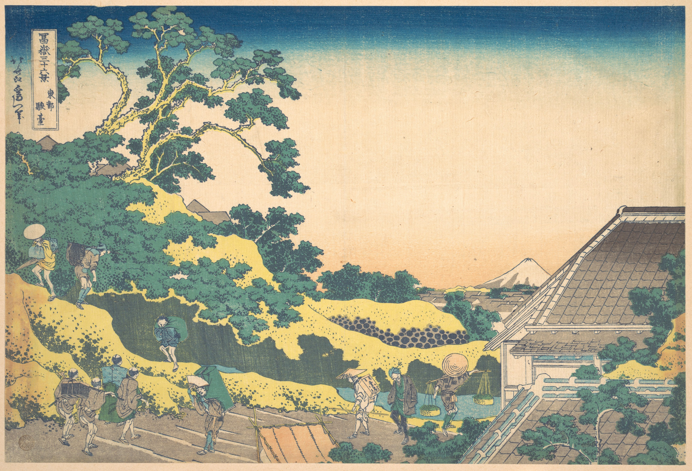

# 5. Район Сундай в Эдо (Sundai, Edo)

## Варианты названия

Варианты названия:

- *"Сундай, Эдо"*
- *"Sundai, Edo"*
- *"Tōto sundai"*

## Описание

- **Размеры**: 24.8 cm x 36.5 cm

В отличие от монументальных портретов горы, эта работа фокусируется на жизни города и на том, как природа вписывается в повседневную суету. Действие происходит на холме Сундай в районе Канда (современный район Очаномидзу в Токио). Хокусай выбирает высокую точку обзора, что позволяет ему показать крутой склон холма, уходящий вниз, и далекую перспективу города. Гора Фудзи здесь кажется маленькой и скромной, выглядывая из-за забора и деревьев, словно наблюдая за людьми.

На переднем плане гравюры виднеются торговцы, разносчики, горожане, занятые различными видами работ, и самураи. Привлекают внимание ветви сосны, склонившиеся над дорогой.

- [К оглавлению](./Thirty-six_Views.md)
- [Вперёд](./06_Cushion_Pine_at_Aoyama.md)
