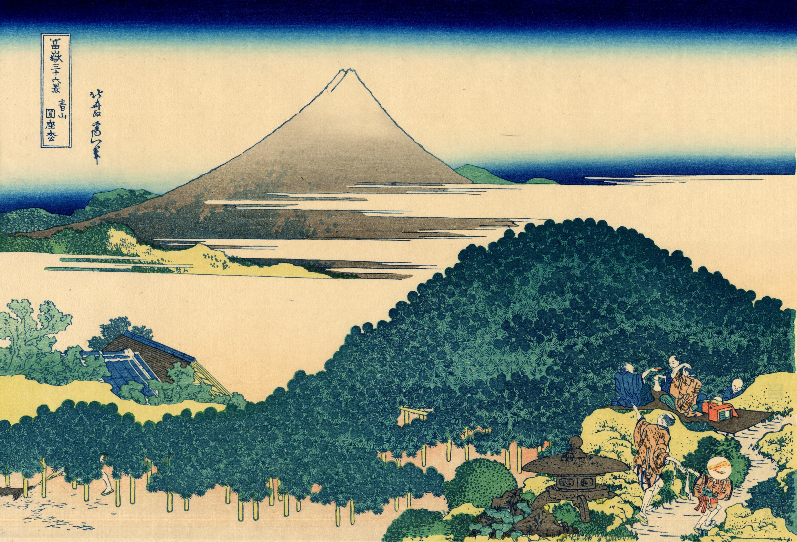

# 6. Cushion Pine at Aoyama

Варианты названия:

- *"Сосна-подушка в Аояма"*
- *"Cushion Pine at Aoyama"*
- *"Aoyama enza no matsu"*

Сосны с раскидистыми ветвями выглядят как гигантская зелёная подушка, отсюда и название. Некоторые ветви настолько длинные, что их поддерживают бамбуковые подпорки. Хокусай тщательно прорисовал каждую ветку и иголку. На переднем плане изображены отдыхающие. Объединяя Cushion-pine и Фудзи, художник обращается к интересам публики, сочетая известные места с образом горы.
