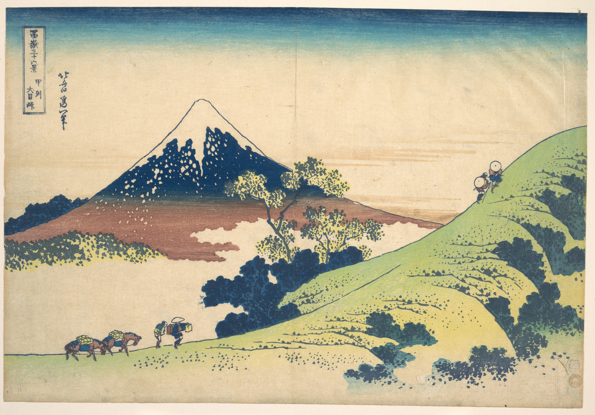

# 8. The Inume Pass in Kai Province

Варианты названия:

- *"Перевал Инуми в провинции Каи"*
- *"The Inume Pass in Kai Province"*
- *"Kōshū Inume tōge"*

Уникальные отношения между человеком и природой художественно показаны через маленькие фигуры, идущие по холму, над которыми возвышается огромная гора Фудзи. Облака за путешественниками подчеркивают расстояние между людьми и горой. Впечатляющая ксилография создаёт атмосферу, где время и ветер будто текут в замедленном движении.

- [К оглавлению](./Thirty-six_Views.md)
- [Вперёд](./09_Fuji_View_Field_in_Owari_Province.md)
