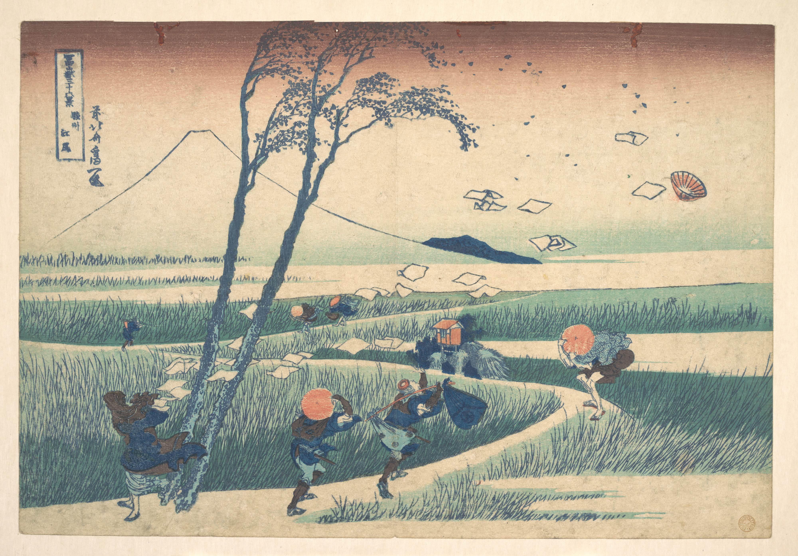

# 10. Ejiri in Suruga Province

Варианты названия:

- *"Эдзири в провинции Суруга"*
- *"Ejiri in Suruga Province"*
- *"Suruga Ejiri"*

Фигуры и деревья на тропе через болото борются с ветром на переднем плане: потоки бумажных платков, шляпы и листья уносятся ветром в небе; на заднем плане — гора Фудзи.
