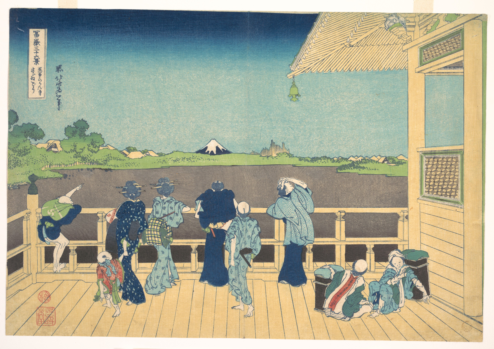

# 13. Sazai hall – Temple of Five Hundred Rakan

Варианты названия:

- *"Зал Сазай — храм пятисот араканов"*
- *"Sazai hall – Temple of Five Hundred Rakan"*
- *"Tōto Gohyaku Rakan Sazai-dō"*

Идиллическая сцена с пятью фигурами — мужчинами, женщинами и детьми, стоящими на веранде у храма. Перед ними простирается озеро или болото, уходящее к горизонту вдали. Изображение составлено так, что большинство девяти фигур видно сзади, как будто зритель стоит за ними и тоже наблюдает за видом. Фудзи, повторяющая тема в работах Хокусая, видна вдалеке; также узнаваемы для тех, кто знаком с японской географией, лесопилки Фукагавы. Умение Хокусая изображать человеческие образы так же искусно, как и мастерство изображения природы: девять фигур каждая со своим характером, от той, что слева, с нетерпением указывающей в сторону Фудзи, до той, что справа, вытирающей пот со лба.
