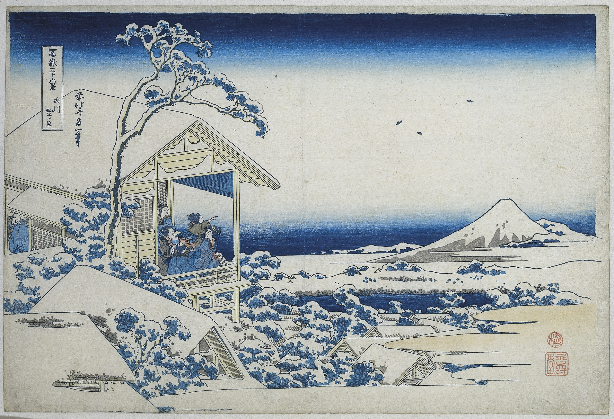

# 14. Tea house at Koishikawa. The morning after a snowfall

Варианты названия:

- *"Чайный домик в Коисикава. Утро после снегопада"*
- *"Tea house at Koishikawa. The morning after a snowfall"*
- *"Koishikawa yuki no ashita"*

На картине изображена группа мужчин и женщин на террасе чайного домика, смотрящих на гору Фудзи. Чайный домик может показаться невинным местом, но в то время, когда работал Хокусай, чайный домик часто был местом для тайных встреч парочек. Тем не менее, все, глядя на преобразованный пейзаж, испытывают благоговение и удивление перед изменениями, принесёнными снегопадом.
