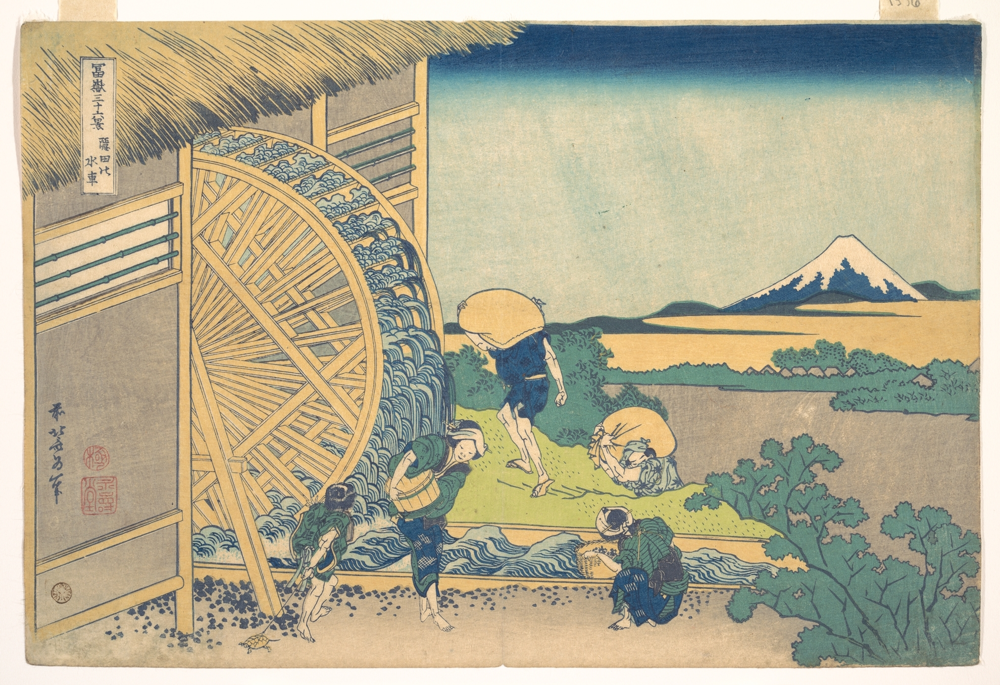

# 16. Watermill at Onden

Варианты названия:

- *"Водяная мельница в Ондэне"*
- *"Watermill at Onden"*
- *"Onden no suisha"*

Сейчас расположенная на территории двух самых оживлённых районов Токио, Ондэн когда-то находилась за храмом Зэнкодзи в районе Аояма. Это была небольшая фермерская деревня, усыпанная множеством водяных колёс, приводимых в движение великой рекой Сибуя. Именно одну из этих водяных мельниц изобразил выдающийся японский художник Кацусика Хокусай на своей гравюре «Водяная мельница в Ондэне». Изображение является одним из 36, которые Хокусай начал создавать в 1830 году в возрасте 70 лет.
