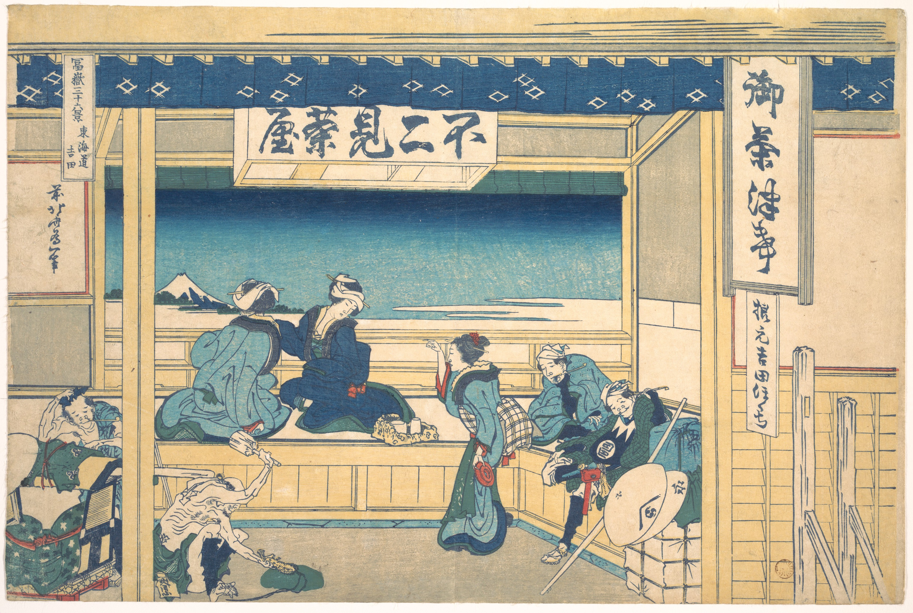

# 19. Yoshida at Tōkaidō

Варианты названия:

- *"Ёсида на Токайдо"*
- *"Yoshida at Tokaido"*
- *"Yoshida on the Tokaido"*
- *"Tōkaidō Yoshida"*

На гравюре Хокусай изображает живописное место в чайном домике под названием Фудзими Тая, что переводится как «чайный домик с видом на гору Фудзи». Это название также написано на горизонтальной панели в центре отпечатка. Две женщины, кажется, наслаждаются видом на Фудзи. Треугольная компоновка фигур на переднем плане напоминает форму самой горы Фудзи.
