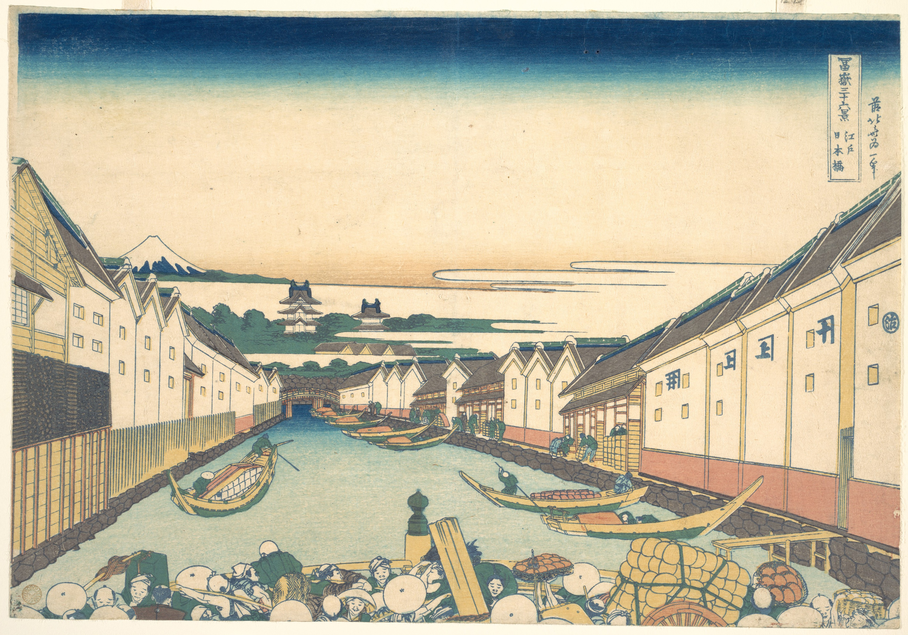

# 21. Nihonbashi Bridge in Edo

Варианты названия:

- *"Мост Нихонбаси в Эдо"*
- *"Nihonbashi bridge in Edo"*
- *"Nihonbashi in Edo"*

Композиция интересна тем, что изображение кажется обрезанным, и вы не будете одиноки в том, что подумаете, что изображение было изменено на вашем экране, но это не так — так было задумано. Считается, что цель заключалась в том, чтобы создать впечатление, что вы являетесь частью сцены, пробираясь сквозь бурлящие толпы, пытающихся перейти мост. Хаотичная сцена делает сам мост едва различимым, его можно разглядеть, если очень внимательно посмотреть в нижней части картины и заметить финишное украшение на столбе ворот.
