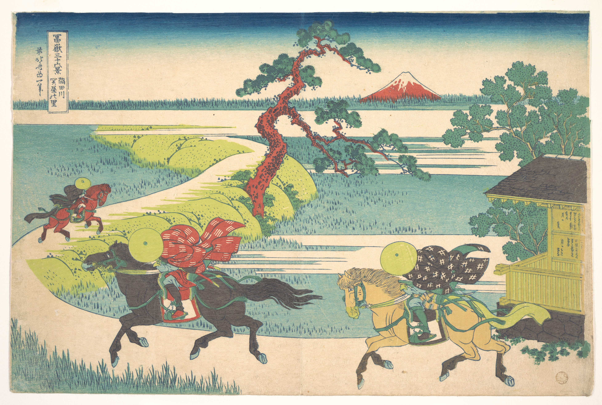

# 22. Barrier Town on the Sumida River

Варианты названия:

- *"Городская преграда на реке Сумида"*
- *"Barrier Town on the Sumida River"*
- *"Sumida-gawa Sekiya no sato"*

Работа выполнена в более сдержанных и органичных тонах. Коричневые, красные и светло-голубые цвета доминируют в произведении, и интересно, что на заднем плане остаётся много пустого пространства. Считается, что такой подход мог быть результатом сильных религиозных убеждений Хокусая, особенно в более поздний период жизни. Как видно на многих других его работах, на картине ясно видна гора Фудзи. Это не только символизирует Японию в целом, но и является отражением его буддийских взглядов. Тот факт, что три персонажа, изображённых на картине, кажется, направляются к подножию горы, можно интерпретировать как желание стать ближе к своему духовному началу. Хотя эта работа не так известна, как другие произведения Хокусая, «Городская преграда на реке Сумида» определённо демонстрирует его талант.
