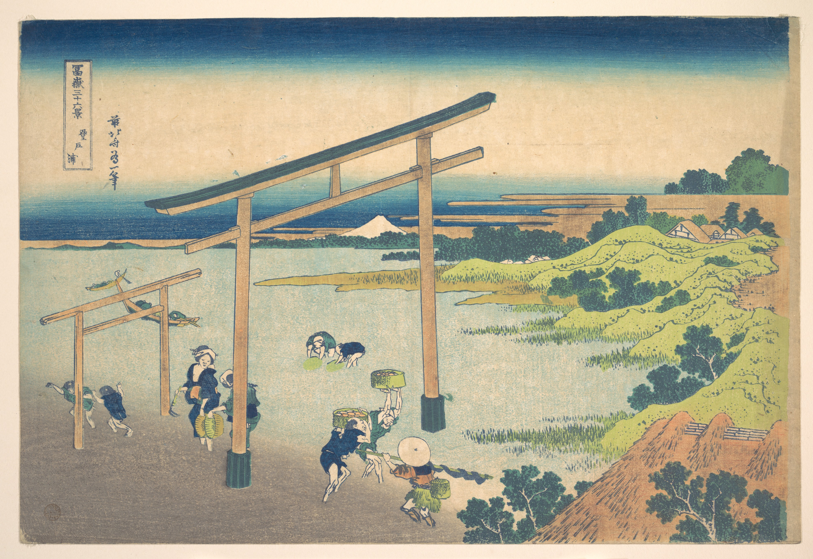

# 23. Bay of Noboto

Варианты названия:

- *"Залив Нобото"*
- *"Bay of Noboto"*
- *"Noboto no ura"*

Мужчины и женщины собирают моллюсков под тории — входными воротами к святилищам, которые обозначают переход от светского к религиозному. Хокусай ловко использует тории, чтобы обрамить Фудзи, подчеркивая священный, иконический характер горы.
