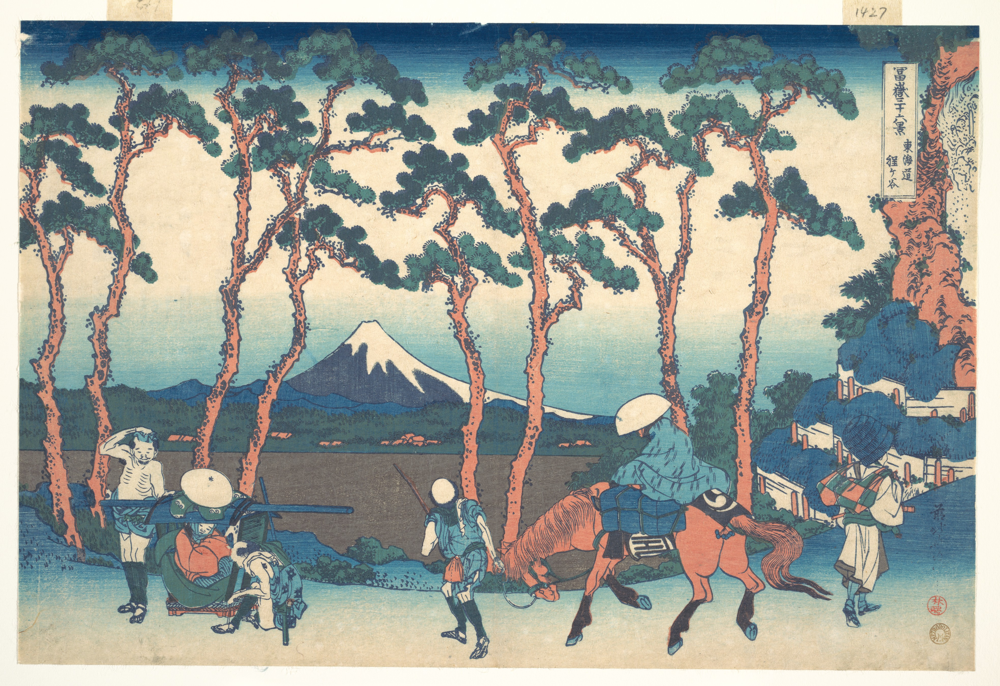

# 26. Hodogaya on the Tōkaidō

Варианты названия:

- *"Ходогая на Токайдо"*
- *"Hodogaya on the Tokaido"*
- *"Tōkaidō Hodogaya"*

В этой работе Хокусай изображает путешественников по Токайдо, проходящих через станцию Ходогая. Почти все направляются на запад, выглядя уставшими от подъёма на холм Гонта-дзака. Слева паланкинщики отдыхают, справа — одинокий пешеход, одетый в традиционную одежду буддийского монаха, смотрит на вырезанное в скале религиозное изображение. Центр композиции занимает гора Фудзи, но именно на переднем плане Хокусай использует свою образность, чтобы бросить вызов зрителю. Всадник на лошади и человек, ведущий лошадь, кажутся созерцающими сцену. Цвета одежды путешественников гармонируют с природой, а группы сосновых иголок отражают форму горы.
