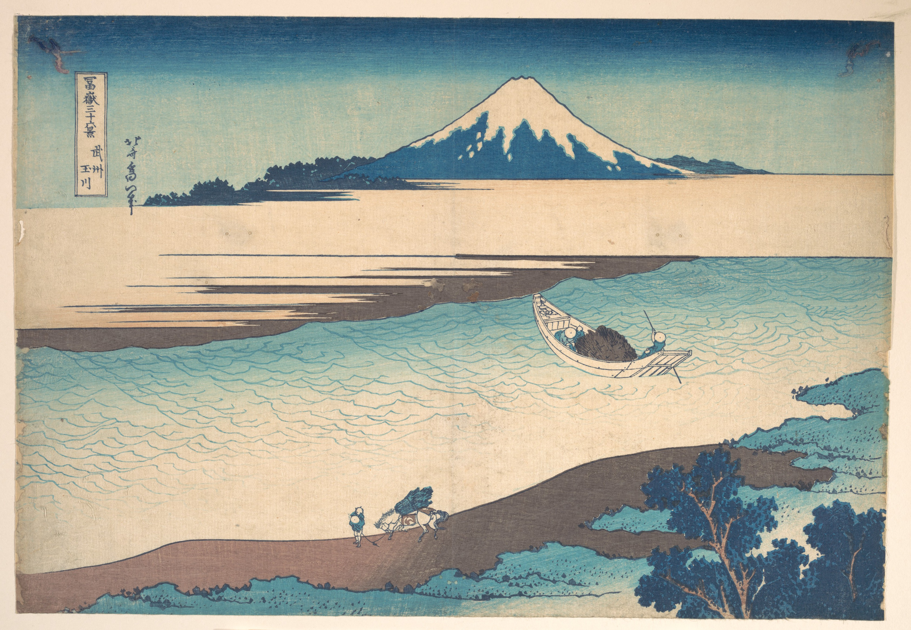

# 27. Tama River in Musashi Province

Варианты названия:

- *"Река Тама в провинции Мусаси"*
- *"Tama River in Musashi Province"*
- *"Musashi Tamagawa"*

На отпечатке раскрывается красота японских пейзажей: реки, заснеженные горы и живописные виды. Поздние отпечатки, посвящённые той же теме, показывали образ жизни людей, включая развитие провинции Мусаси и человеческую деятельность.
