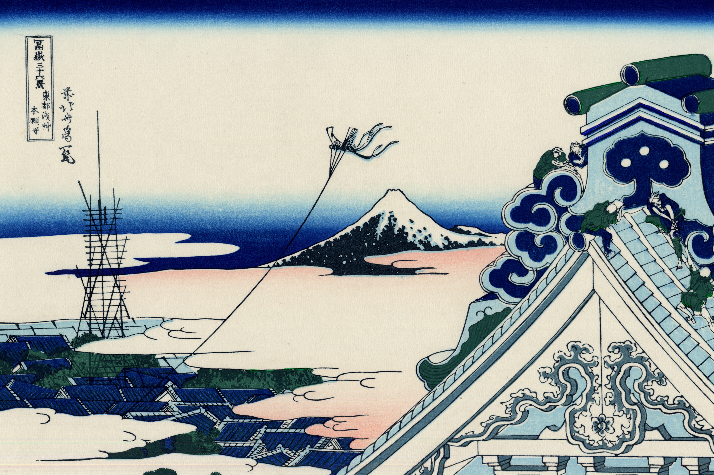

# 28. Asakusa Hongan-ji Temple in the Eastern Capital (Edo)

Варианты названия:

- *"Храм Асакуса Хонган-дзи в восточной столице (Эдо)"*
- *"Asakusa Hongan-ji temple in the Eastern capital [Edo]"*
- *"Tōto Asakusa Hongan-ji"*

Асакуса был самым населённым районом в Эдо во времена Хокусая. Его улицы были заполнены магазинами, где оживлённо торговали купцы и ремесленники. Одной из достопримечательностей был храм Асакуса Хонган-дзи, построенный в 1657 году. В композиции Хокусай приблизил здание храма так, что видна только вершина крыши, а над ней — гора Фудзи, повторяющая форму крыши. На крыше рабочие заняты ремонтом, их позы взяты из альбомов эскизов «Manga». Воздушный змей указывает на зиму, скорее всего, Новый год.
