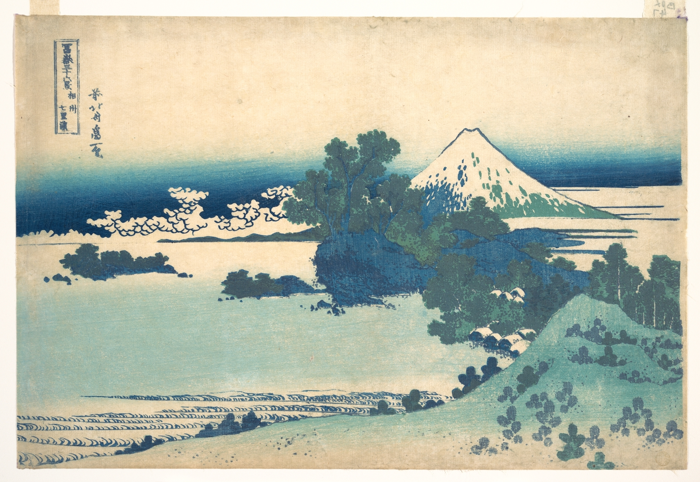

# 30. Shichiri Beach in Sagami Province

Варианты названия:

- *"Пляж Сичири в провинции Сагами"*
- *"Shichiri beach in Sagami Province"*
- *"Sōshū Shichiri-ga-hama"*

Цвета традиционно японские. Искусство Хокусая показывает, как люди соединяются с природой в повседневной жизни. Он смешивал традиционные методы и западные, его работы вдохновляли таких художников, как Дега и Моне.
