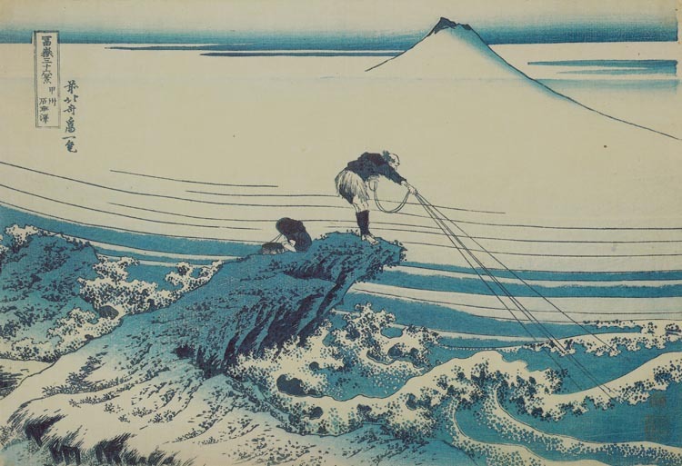

# 32. Kajikazawa in Kai Province

Варианты названия:

- *"Кадзикадзава в провинции Каи"*
- *"Kajikazawa in Kai Province"*
- *"Kōshū Kajikazawa"*

Изображён человек, стоящий на скале, вытаскивающий сеть, и мальчик с корзиной рыбы. Хотя кажется, что это море, на самом деле это река Фудзи. Контраст между неподвижным рыбаком и бурной водой подчёркивает динамику сцены.
