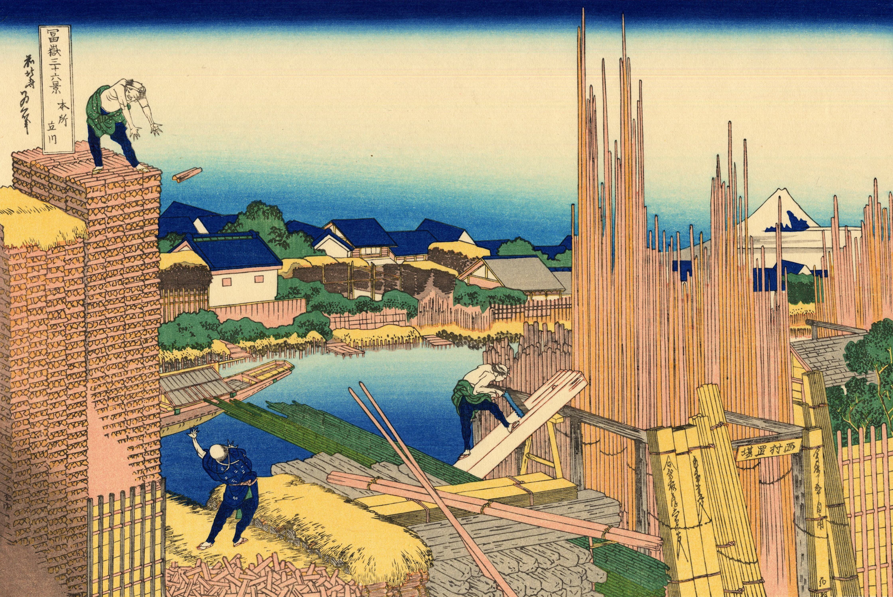
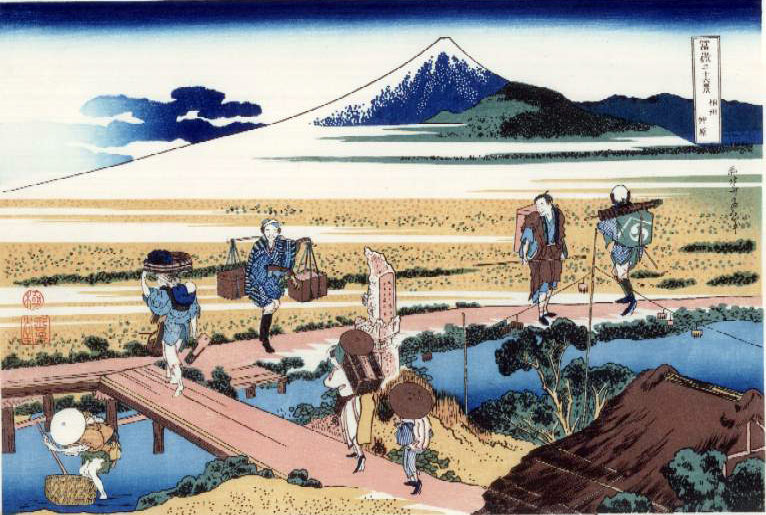
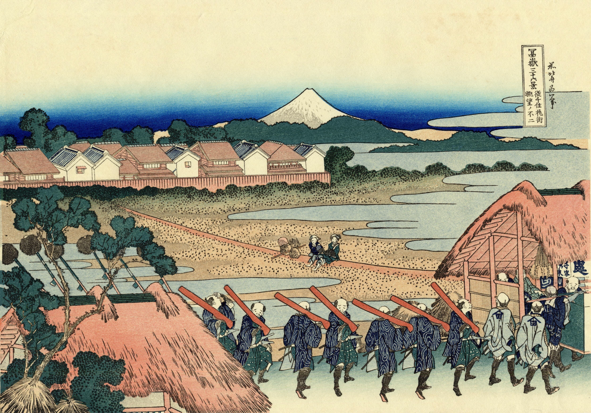
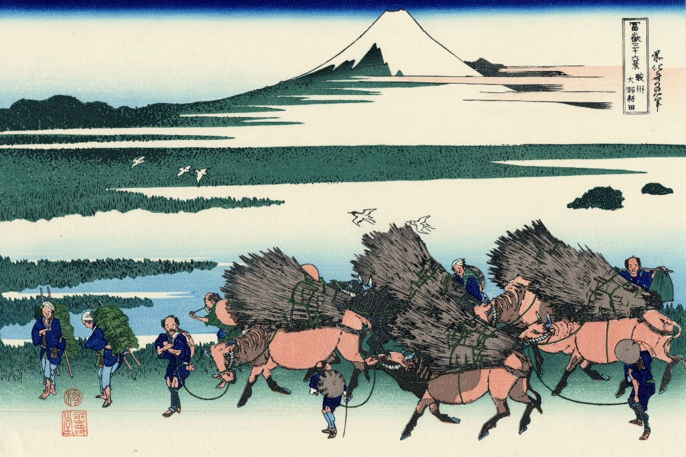
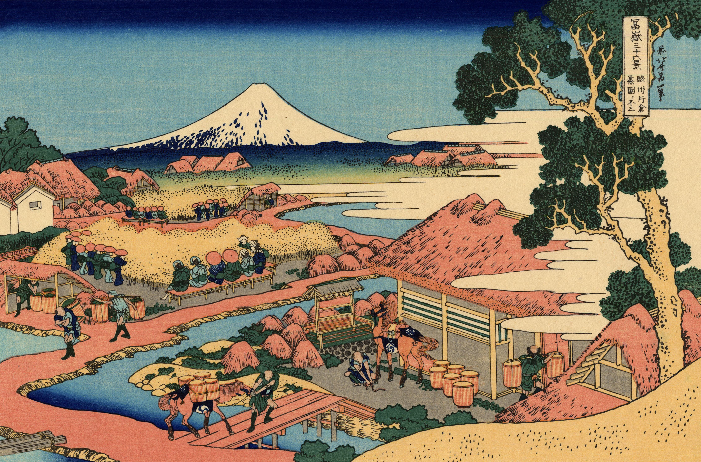
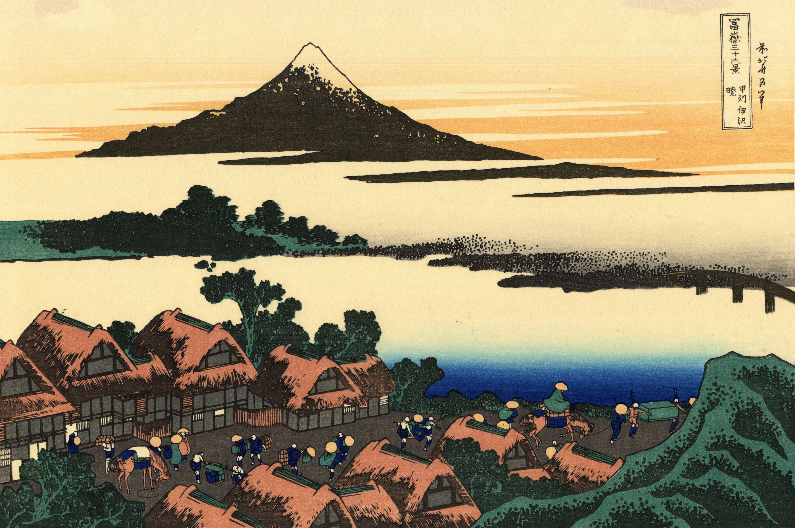
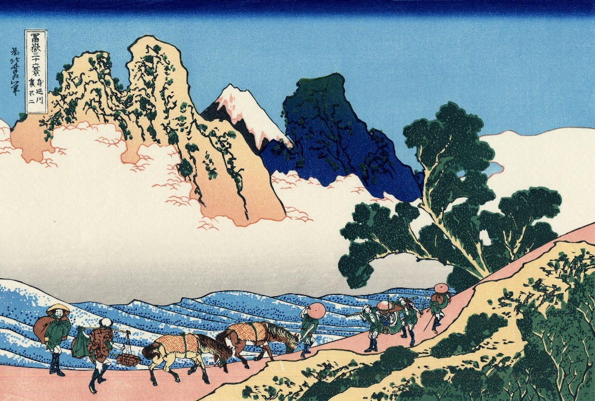

# The Extended 36 Views of Mt. Fuji

## 37. Goten-yama-hill, Shinagawa on the Tokaido

Гора Готен-яма в Синагаве была известна своими красивыми цветами сакуры в знаменитый период Эдо. Хокусай сделал всего одну гравюру о цветении сакуры в «Тридцати шести видах Фудзи». Но не менее талантливый художник, который напечатал несколько работ на эту тему, — Утагава Хиросигэ. Люди, участвующие в любовании бледно-розовыми цветами, отвлекают внимание от того факта, что гора Готен-яма в Синагаве была исключительно красивой. Кажется, они также наслаждаются прекрасным видом на гору Фудзи. Но трое мужчин слева на горе Готен-яма в Синагаве, похоже, наслаждаются едой и напитками.

## 38. Honjo Tatekawa, the timberyard at Honjo, Sumida

Одной из самых сложных его работ, возможно, является гравюра Кацусики Хокусая «Хондзё Татэкава, лесопилка в Хондзё, Сумида». Эта японская ксилография изображает работу ландшафта Хокусая, часть его серии «Тридцать шесть видов Фудзи» ксилографий. Она изображает как промышленность, так и деятельность, выполненные в традиционном стиле укиё-э, с использованием прозрачных водяных красок. Это в значительной степени линейная работа, использующая противопоставленные углы во всех аспектах для создания визуально интересных областей. Наши глаза сразу же притягиваются к длинным вертикальным линиям брусьев справа, затем к курьезно согнутым позам мужчин, работающих на лесопилке. Даже формы плоти и крови странно угловаты. При более тщательном рассмотрении мы находим, что крыши домов состоят из множества углов, единственным смягчающим элементом являются изогнутые кроны деревьев или кустов среди домов и брусьев. Мужчина на верхнем левом углу бросает то, что кажется, бревном вниз к своему ожидающему напарнику внизу, в то время как третий мужчина согнулся над своей пилой, справа от картины, пилит своё бревно по идеально прямой линии. Отпечаток передаёт невероятное количество выполненной работы, потраченной энергии; но на сцене мы видим только троих мужчин. Его привлекательность заключается в иллюстрации деятельности и намёке на движение к прогрессивности.

## 39. Pleasure District at Senju

«Район удовольствий в Сеню» — это изображение района красных фонарей, более известного как район удовольствий в Японии. В этом районе, как правило, жили женщины-проститутки, но мужчины также могли посещать дома, где женщины работали в качестве развлекательниц и служанок, поднимая им настроение. На картине изображена сцена на дороге Сеню. Даймё ведёт процессию, за которой следуют несколько его самураев, вооружённых ружьями, завернутыми в красновато-коричневую ткань. Все самураи одеты одинаково в зелёные туники и синие робу. Каждый из них носит два ножа, как того требует кодекс самураев. В начале процессии даймё несут на паланкине двое слуг, одетых в серое. Две женщины сидят посреди дороги, наблюдая за процессией.

## 40. Nakahara in Sagami Province

На этой выразительной сцене зрителю представляется оживлённый переход через реку, где встречаются путешественники вдоль маршрута и местные жители провинции Сагами. В левом углу изображён рыбак, ловящий рыбу в мелководье, пока двое паломников проходят мимо него направо на мост — дорожный резной бог Фудо, отмечающий путь к Ояме, позади них. Перед парой идёт женщина с ребёнком, привязанным к спине в современном стиле, а также нагруженная инструментами и другими предметами труда. На среднем плане, вдоль шоссе Токаидо, суета дня продолжается с местным фермером, надеющимся продать семена паломникам, идущим через мост. Перед ним, с тоской глядя на товары фермера, другой паломник, возможно, надеющийся выпросить еду и питьё. Он отвернут от другого местного жителя, кажется, нагруженного припасами. На заднем плане находится священная гора Фудзи, как и в большинстве произведений Хокусая, расположенная спереди и в центре, хотя, казалось бы, не являющаяся предметом изображения. Форма Фудзи отзывается в правом переднем углу изображения через крышу хижины, что придаёт картине дополнительный резонанс и баланс. Отпечаток выполнен одним из предпочитаемых Хокусаем методов цветной ксилографии на бумаге, ограниченная палитра приятно смотрится, приглашая к более тщательному изучению.

## 41. ono Shinden in Suruga Province

«Оно Синден в провинции Суруга» — это древесная гравюра, изображающая рисовые поля Оно в провинции Суруга. На переднем плане картины изображены лошади, несущие огромные грузы только что собранного риса. Несколько крестьян, все одетые одинаково в синее, как в униформу, загружают рис на спины лошадей, управляют лошадьми или несут меньшие грузы на своих спинах. За ними рисовые поля тянутся до самого горизонта. Птицы летают над полями, показывая время года. Картина изображает повседневную жизнь фермеров в хороший день во время сбора урожая. Вдалеке гора Фудзи доминирует на горизонте, служа подходящим фоном для рисовых полей.

## 42. Climbing on Fuji

Паломники, поднимающиеся по горному пути с посохами, сидящие от усталости и отдыхающие в пещере.

## 43. The Tea plantation of Katakura in Suruga Province

«Чайная плантация Катакаура в провинции Суруга» — это великолепная древесная гравюра, изображающая всю работу на чайной плантации. Картина меньше о ландшафтном изображении самой чайной плантации, а больше о повседневной жизни в ней.

## 44. The Fuji from Kanaya on the Tokaido

На картине Хокусай изображает путешественников, пересекающих реку oи в Канае на шоссе Тoкаидo. Он располагает людей с паланкинами в уникальном ритмичном стиле среди стремительных волн. Хокусай использует монохромную гору Фудзи, чтобы цвета играли в бурном порядке, бросая вызов друг другу несколькими линиями Фудзи.

## 45. Dawn at Isawa in Kai Province

Цветная ксилография обан. Вид на гору Фудзи с севера на рассвете в Исаве: путешественники в глубоких круглых шляпах заполняют дорогу и готовятся к раннему выходу: загружают вьючных лошадей и носят переносные шесты; река Фуэфуки за гостиницами, пересекаемая мостом справа.

## 46. The back of Fuji from the Minobu river

«Задняя сторона Фудзи с реки Минобу» или «Минобу-гава ура Фудзи» — одна из серий Кацусики Хокусая «Тридцать шесть видов Фудзи» или «Фугаку санжуроккэй» (обан Ёко-е). Хокусай изображает путешественников и лошадей, идущих к храму Куондзи, который считается главной святыней секты Ничирэн.
