# Thirty-six Views of Mount Fuji

«Тридцать шесть видов Фудзи» — серия работ талантливого Кацусики Хокусая. Искусство этой серии любимо так же, как и сама гора Фудзи. Его работы настолько ценны, что оригиналы увидеть очень сложно.

Серия создавалась с 1830 по 1832 год, когда Хокусаю было за семьдесят. Каждое изображение включало рисунок на бумаге, который затем использовался для вырезания на дереве. Деревянная доска покрывалась тушью и прикладывалась к бумаге для создания отпечатка. Художник использовал множество цветов, что делало его работы уникальными. Изначально Хокусай создал 36 видов горы Фудзи, но из-за популярности серии добавил ещё десять.

Гора Фудзи — популярный сюжет японского искусства из-за её культурного и религиозного значения. Эта традиция восходит к «Сказке о резчике бамбука», где богиня оставляет эликсир жизни на вершине горы. Как объясняет историк Генри Смит: «С ранних времён Фудзи считалась источником секрета бессмертия, что лежало в основе одержимости Хокусая этой горой». Каждый отпечаток создавался путём наклеивания рисунка на бумаге на деревянную доску для вырезания. Оригинальный рисунок при этом терялся. Доска покрывалась тушью и прикладывалась к бумаге для создания изображения (см. «Ксилография в Японии» для подробностей). Сложность работ Хокусая заключается в широком диапазоне используемых цветов, для каждого из которых требовалась отдельная доска. Самые ранние отпечатки серии были выполнены преимущественно в синих тонах (aizuri-e), включая основные контуры. Прусский синий пигмент был недавно завезён в Японию из Европы, и Хокусай использовал его широко, что обеспечило его популярность. После того как издатель Нисимура убедился в успехе серии, отпечатки стали делать с использованием нескольких цветов (nishiki-e). Нисимура планировал расширить серию до более чем ста отпечатков, но публикация остановилась на сорока шести. Самое известное изображение из серии — «Большая волна у Канагавы». Это самая знаменитая работа Хокусая и, возможно, самое узнаваемое произведение японского искусства в мире. Другая иконическая работа из серии — «Ясный день с ветром» (или «Красная Фудзи»), которую называют «одной из самых простых и одновременно выдающихся японских гравюр».

## 1. The Great Wave off Kanagawa

Варианты названия:

- *"Большая волна у Канагавы"*
- *"The Great Wave off Kanagawa"*
- *"Kanagawa oki nami ura"*

Самая заметная особенность картины — огромная волна, готовая обрушиться с хищным гребнем. Красивый тёмно-синий пигмент, использованный Хокусаем, называется прусским синим и был новым материалом того времени, завезённым из Англии через Китай. Волна вот-вот накроет лодки, словно огромное чудовище, символизируя неодолимую силу природы и слабость человека.

## 2. Red Fuji

Варианты названия:

- *"Красная Фудзи"*
- *"Red Fuji"*
- *"South Wind, Clear Sky"*
- *"Gaifu kaisei"*

Гора Фудзи ранней осенью. Отпечаток был создан Хокусаем в начале осени 1830 года. Этот стиль японской гравюры называется укиё-э («картины изменчивого мира»). Работа была создана на пике славы художника при поддержке издателя Нисимуры Ёхати, одного из ведущих издателей ксилографий того времени.

## 3. Thunderstorm Beneath the Summit

Варианты названия:

- *"Гроза у подножия горы"*
- *"Thunderstorm Beneath the Summit"*
- *"Sanka hakuu"*

Композиция очень похожа на «Ясный день с ветром» («Красная Фудзи») из той же серии, но атмосфера здесь совершенно иная. Вместо туманного и спокойного вида гора Фудзи изображена мрачно, в насыщенных тёмных тонах. Контуры горы более текстурированы и чётко очерчены. Снежная вершина резко возвышается над тёмным основанием, рассечённым молнией, изображённой мощными, почти абстрактными зигзагообразными линиями. Как и в «Красной Фудзи», тонкая линия прусского синего используется в верхней части неба, но здесь облака напоминают дым и словно цепляются за гору. Три вершины на пике указывают, что вид — с западной стороны.

## 4. Under Mannen Bridge at Fukagawa

Варианты названия:

- *"Под мостом Маннен в Фукагава"*
- *"Under Mannen Bridge at Fukagawa"*
- *"Fukagawa Mannen-bashi shita"*

На отпечатке изображены различные рыбацкие и торговые сцены под мостом, передающие аграрную и торговую атмосферу Фукагава, района Токио XIX века. Вдали под мостом видна гора Фудзи с заснеженной вершиной — символ Японии.

## 5. Sundai, Edo

Варианты названия:

- *"Сундай, Эдо"*
- *"Sundai, Edo"*
- *"Tōto sundai"*

Известная как 東都駿台 или Toto sundai на японском, эта гравюра — пятая в коллекции. Между 1830 и 1832 годами, в эпоху Эдо, Хокусай был в расцвете творчества, когда создавал это произведение.

## 6. Cushion Pine at Aoyama

Варианты названия:

- *"Сосна-подушка в Аояма"*
- *"Cushion Pine at Aoyama"*
- *"Aoyama enza no matsu"*

Сосны с раскидистыми ветвями выглядят как гигантская зелёная подушка, отсюда и название. Некоторые ветви настолько длинные, что их поддерживают бамбуковые подпорки. Хокусай тщательно прорисовал каждую ветку и иголку. На переднем плане изображены отдыхающие. Объединяя Cushion-pine и Фудзи, художник обращается к интересам публики, сочетая известные места с образом горы.

## 7. Senju, Musashi But

Варианты названия:

- *"Сэндзю, Мусаси"*
- *"Senju, Musashi But"*
- *"Musashi Senju"*

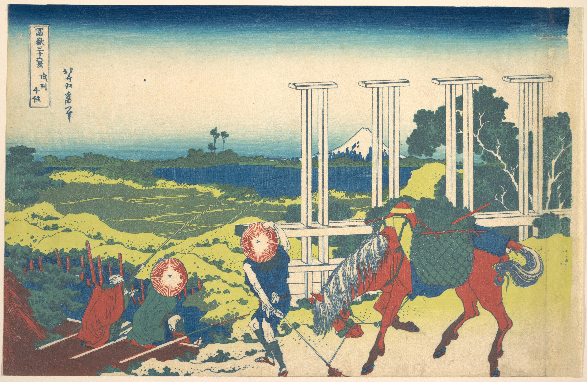

Хокусай изображает фермера с лошадью и рыбака, который, прикрыв глаза рукой от солнца, смотрит на гору Фудзи. Возможно, они обсуждают панорамный вид на гору, пока лошадь идёт неспешно. Геометрические формы шлюза на переднем плане подчёркивают красоту горы.

## 8. The Inume Pass in Kai Province

Варианты названия:

- *"Перевал Инуми в провинции Каи"*
- *"The Inume Pass in Kai Province"*
- *"Kōshū Inume tōge"*

Уникальные отношения между человеком и природой художественно показаны через маленькие фигуры, идущие по холму, над которыми возвышается огромная гора Фудзи. Облака за путешественниками подчеркивают расстояние между людьми и горой. Впечатляющая ксилография создаёт атмосферу, где время и ветер будто текут в замедленном движении.

## 9. Fuji View Field in Owari Province

Варианты названия:

- *"Поле с видом на Фудзи в провинции Овари"*
- *"Fuji View Field in Owari Province"*
- *"Owari Fujimi-ga-hara"*

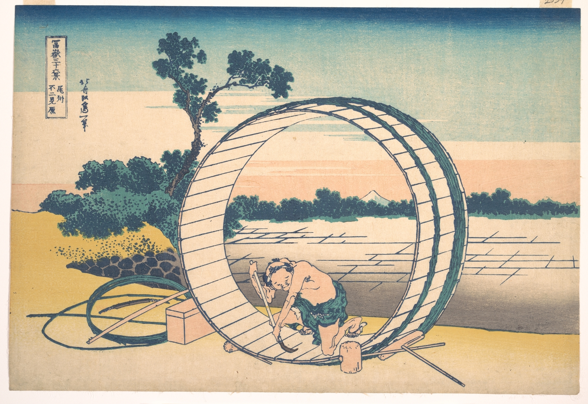

На гравюре изображён человек за работой, а фон выполнен так, что напоминает театральную сцену. В этой работе Хокусай экспериментировал с восточными традициями и западными техниками.

## 10. Ejiri in Suruga Province

Варианты названия:

- *"Эдзири в провинции Суруга"*
- *"Ejiri in Suruga Province"*
- *"Suruga Ejiri"*

Фигуры и деревья на тропе через болото борются с ветром на переднем плане: потоки бумажных платков, шляпы и листья уносятся ветром в небе; на заднем плане — гора Фудзи.

## 11. A sketch of the Mitsui shop in Suruga in Edo

Варианты названия:

- *"Эскиз магазина Мицуй в Суруга, Эдо"*
- *"A sketch of the Mitsui shop in Suruga in Edo"*
- *"Edo Suruga-cho Mitsui mise ryakuzu"*

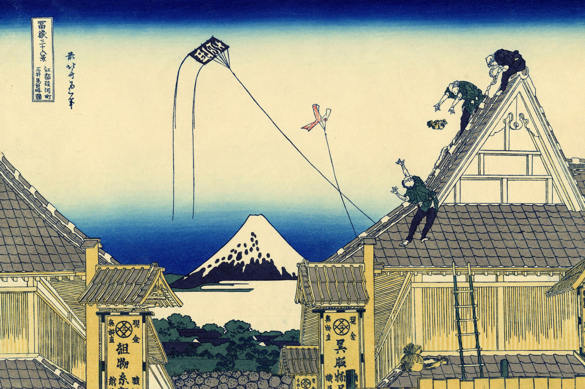

Самый интересный аспект отпечатка — его связь с деньгами. На первый взгляд, отпечаток изображает текстильный магазин, который посещают несколько клиентов и люди разных классов. Однако исследование местоположения и имени Мицуй открывает интересные связи с деньгами, выходящие за рамки того, что можно увидеть на отпечатке. Эчигойя, наряду с другими магазинами, принадлежащими Мицуй, использовал стратегию, которая ранее не применялась в Японии. Традиционно портные посещали клиентов, снимали мерки и заказы. Затем одежда изготавливалась позже и доставлялась клиенту в течение нескольких дней. В Эчигойя кимоно и другая одежда изготавливались заранее и продавались по фиксированной цене. Одежду можно было подогнать на месте, и некоторые клиенты уезжали с заказом «после короткого ожидания».

## 12. Sunset across the Ryogoku bridge from the bank of the Sumida River at Onmayagashi

Варианты названия:

- *"Закат у моста Рёгоку с берега реки Сумида в Онмаягаси"*
- *"Sunset across the Ryogoku bridge from the bank of the Sumida River at Onmayagashi"*
- *"Onmayagashi yori Ryōgoku-bashi sekiyū o miru"*

Этот отпечаток контрастирует яркими синими волнами на фоне светло-голубой реки с тёмно-синей горой Фудзи, которая выделяется на фоне светлого неба. Лодка с пассажирами смотрит в сторону моста. Считается, что введение синтетического красителя прусского синего цвета оказало сильное влияние на эту коллекцию видов на Фудзи.

## 13. Sazai hall – Temple of Five Hundred Rakan

Варианты названия:

- *"Зал Сазай — храм пятисот араканов"*
- *"Sazai hall – Temple of Five Hundred Rakan"*
- *"Tōto Gohyaku Rakan Sazai-dō"*

Идиллическая сцена с пятью фигурами — мужчинами, женщинами и детьми, стоящими на веранде у храма. Перед ними простирается озеро или болото, уходящее к горизонту вдали. Изображение составлено так, что большинство девяти фигур видно сзади, как будто зритель стоит за ними и тоже наблюдает за видом. Фудзи, повторяющая тема в работах Хокусая, видна вдалеке; также узнаваемы для тех, кто знаком с японской географией, лесопилки Фукагавы. Умение Хокусая изображать человеческие образы так же искусно, как и мастерство изображения природы: девять фигур каждая со своим характером, от той, что слева, с нетерпением указывающей в сторону Фудзи, до той, что справа, вытирающей пот со лба.

## 14. Tea house at Koishikawa. The morning after a snowfall

Варианты названия:

- *"Чайный домик в Коисикава. Утро после снегопада"*
- *"Tea house at Koishikawa. The morning after a snowfall"*
- *"Koishikawa yuki no ashita"*

На картине изображена группа мужчин и женщин на террасе чайного домика, смотрящих на гору Фудзи. Чайный домик может показаться невинным местом, но в то время, когда работал Хокусай, чайный домик часто был местом для тайных встреч парочек. Тем не менее, все, глядя на преобразованный пейзаж, испытывают благоговение и удивление перед изменениями, принесёнными снегопадом.

## 15. Shimomeguro

Варианты названия:

- *"Симомегуро"*
- *"Shimomeguro"*
- *"Tōto Shimomeguro"*

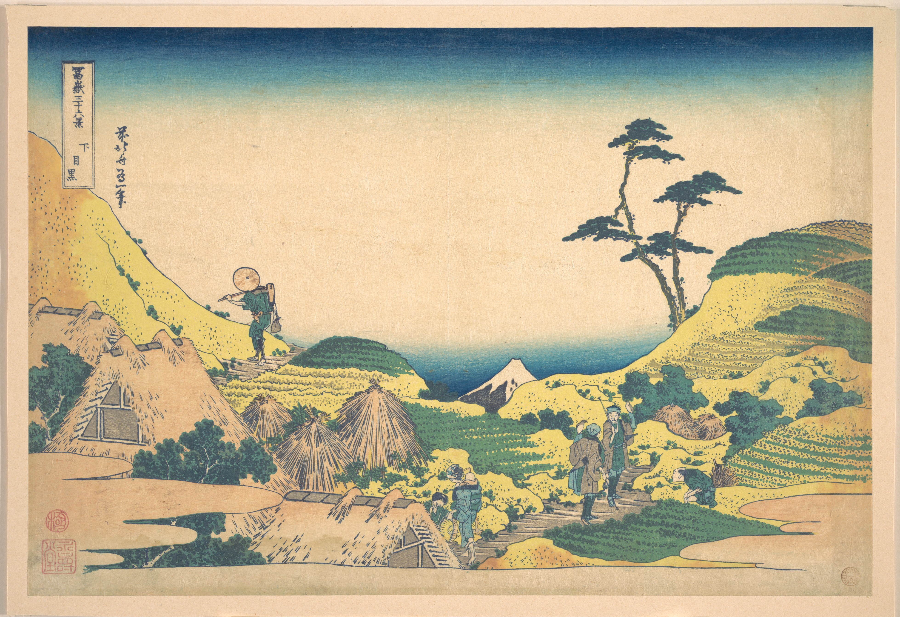

Наклонная оранжево-красная гора с одним пиком поднимается из нижнего левого угла на картине «Легкий ветер в ясный день» (Gaifu kaisei) из серии «36 видов Фудзи».

## 16. Watermill at Onden

Варианты названия:

- *"Водяная мельница в Ондэне"*
- *"Watermill at Onden"*
- *"Onden no suisha"*

Сейчас расположенная на территории двух самых оживлённых районов Токио, Ондэн когда-то находилась за храмом Зэнкодзи в районе Аояма. Это была небольшая фермерская деревня, усыпанная множеством водяных колёс, приводимых в движение великой рекой Сибуя. Именно одну из этих водяных мельниц изобразил выдающийся японский художник Кацусика Хокусай на своей гравюре «Водяная мельница в Ондэне». Изображение является одним из 36, которые Хокусай начал создавать в 1830 году в возрасте 70 лет.

## 17. Enoshima in Sagami Province

Варианты названия:

- *"Эносима в провинции Сагами"*
- *"Enoshima in Sagami Province"*
- *"Sōshū Enoshima"*

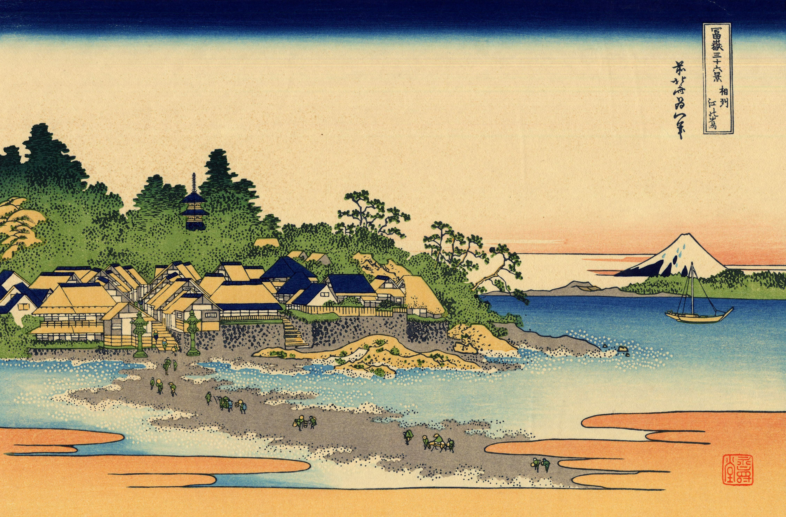

На гравюре «Эносима в провинции Сагами» Хокусай изображает пятиэтажную пагоду храма Рюкодзи, расположенную на дальнем плане среди леса с молодыми листьями. Поклонники, посещающие храм, идут по песчаной косе во время отлива. Вдоль берега изображены различные гостиницы и магазины сувениров. Эта работа передаёт искрящийся пенный удар волн о пляжи и скалы в стиле укиё-э.

## 18. Shore of Tago Bay, Ejiri at Tōkaidō

Варианты названия:

- *"Берег залива Таго, Эдзири на Токайдо"*
- *"Shore of Tago Bay, Ejiri at Tokaido"*
- *"Tago Bay near Ejiri on the Tokaido"*
- *"Tōkaidō Ejiri Tago-no-ura"*

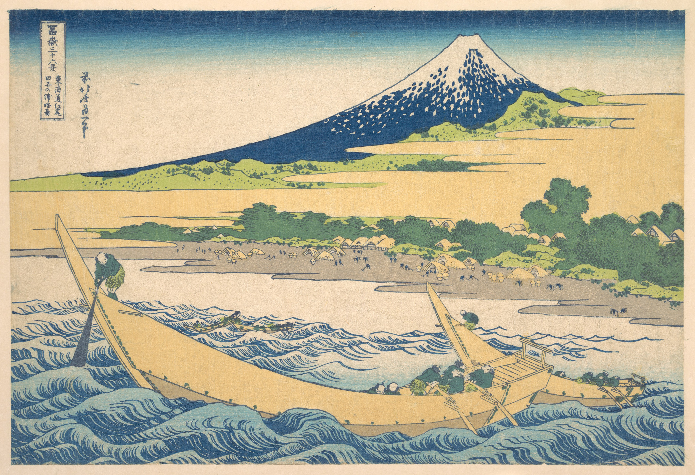

На картине «Залив Таго у Эдзири на Токайдо» Хокусай романтично изображает гору Фудзи, покрытую снегом и удаляющуюся как от облаков, так и от земли, возвышающуюся над заливом Таго. Парусники на бурных водах контрастируют с аналогично мощным, но статичным присутствием Фудзи. Веслаки на джунках изображены измождёнными от работы, что подчеркивает силу вод залива Суруга. Тем временем береговая линия заполнена деятельностью рыбаков и рабочих, несущих корзины с солью для печей вдоль пляжа. Этот акт балансирования между передним и задним планом был перспективой, которую Хокусай часто использовал как средство противовеса. Метод производства этого отпечатка заключался в том, что Хокусай сначала рисовал сцену от руки, а затем переносил её с помощью резчиков по дереву на деревянную доску для печати. Доска покрывалась тушью, а затем прижималась к листу тонкой художественной бумаги. Чтобы достичь богатого разнообразия цветов, присутствующих в «Заливе Таго у Эдзири на Токайдо», создавались многочисленные блоки цветной туши, которые комбинировались при печати.

## 19. Yoshida at Tōkaidō

Варианты названия:

- *"Ёсида на Токайдо"*
- *"Yoshida at Tokaido"*
- *"Yoshida on the Tokaido"*
- *"Tōkaidō Yoshida"*

На гравюре Хокусай изображает живописное место в чайном домике под названием Фудзими Тая, что переводится как «чайный домик с видом на гору Фудзи». Это название также написано на горизонтальной панели в центре отпечатка. Две женщины, кажется, наслаждаются видом на Фудзи. Треугольная компоновка фигур на переднем плане напоминает форму самой горы Фудзи.

## 20. The Kazusa Province Sea Route

Варианты названия:

- *"Морской путь в провинции Кадзуса"*
- *"The Kazusa Province sea route"*
- *"Kazusa no kairo"*

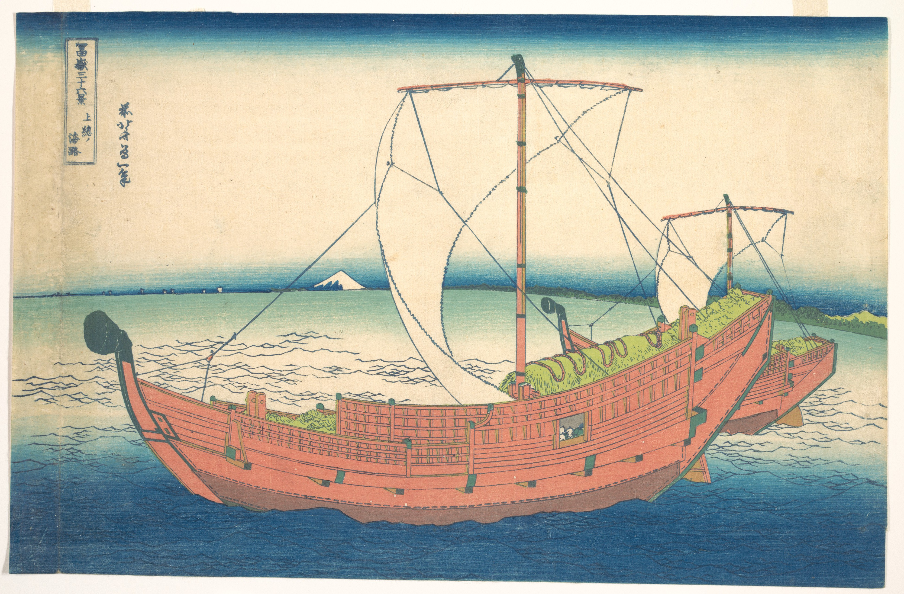

На картине «Морской путь в провинции Кадзуса» изображена очень большая деревянная лодка, плывущая по спокойному океану. Вода здесь выглядит значительно спокойнее, чем на, пожалуй, самой известной работе Хокусая — «Большая волна у Канагавы».

## 21. Nihonbashi Bridge in Edo

Варианты названия:

- *"Мост Нихонбаси в Эдо"*
- *"Nihonbashi bridge in Edo"*
- *"Nihonbashi in Edo"*

Композиция интересна тем, что изображение кажется обрезанным, и вы не будете одиноки в том, что подумаете, что изображение было изменено на вашем экране, но это не так — так было задумано. Считается, что цель заключалась в том, чтобы создать впечатление, что вы являетесь частью сцены, пробираясь сквозь бурлящие толпы, пытающихся перейти мост. Хаотичная сцена делает сам мост едва различимым, его можно разглядеть, если очень внимательно посмотреть в нижней части картины и заметить финишное украшение на столбе ворот.

## 22. Barrier Town on the Sumida River

Варианты названия:

- *"Городская преграда на реке Сумида"*
- *"Barrier Town on the Sumida River"*
- *"Sumida-gawa Sekiya no sato"*

Работа выполнена в более сдержанных и органичных тонах. Коричневые, красные и светло-голубые цвета доминируют в произведении, и интересно, что на заднем плане остаётся много пустого пространства. Считается, что такой подход мог быть результатом сильных религиозных убеждений Хокусая, особенно в более поздний период жизни. Как видно на многих других его работах, на картине ясно видна гора Фудзи. Это не только символизирует Японию в целом, но и является отражением его буддийских взглядов. Тот факт, что три персонажа, изображённых на картине, кажется, направляются к подножию горы, можно интерпретировать как желание стать ближе к своему духовному началу. Хотя эта работа не так известна, как другие произведения Хокусая, «Городская преграда на реке Сумида» определённо демонстрирует его талант.

## 23. Bay of Noboto

Варианты названия:

- *"Залив Нобото"*
- *"Bay of Noboto"*
- *"Noboto no ura"*

Мужчины и женщины собирают моллюсков под тории — входными воротами к святилищам, которые обозначают переход от светского к религиозному. Хокусай ловко использует тории, чтобы обрамить Фудзи, подчеркивая священный, иконический характер горы.

## 24. The Lake of Hakone in Sagami Province

Варианты названия:

- *"Озеро Хаконе в провинции Сагами"*
- *"The lake of Hakone in Sagami Province"*
- *"Sōshū Hakone kosui"*

Провинция Сагами — это современная префектура Канагава. Озеро Хаконе, или озеро Аси, изображено без ряби на поверхности. Вокруг озера раскинулся густой лес, а за ним тянется дымка. На противоположной стороне от Фудзи находится гора Комагатаке. Это тихая и торжественная ксилография укиё-э, на которой нет людей или животных.

## 25. Mount Fuji Reflects in Lake Kawaguchi, Seen from the Misaka Pass in Kai Province

Варианты названия:

- *"Отражение горы Фудзи в озере Кавагути, вид с перевала Мисака в провинции Каи"*
- *"Mount Fuji reflects in Lake Kawaguchi, seen from the Misaka Pass in Kai Province"*
- *"Kōshū Misaka suimen"*

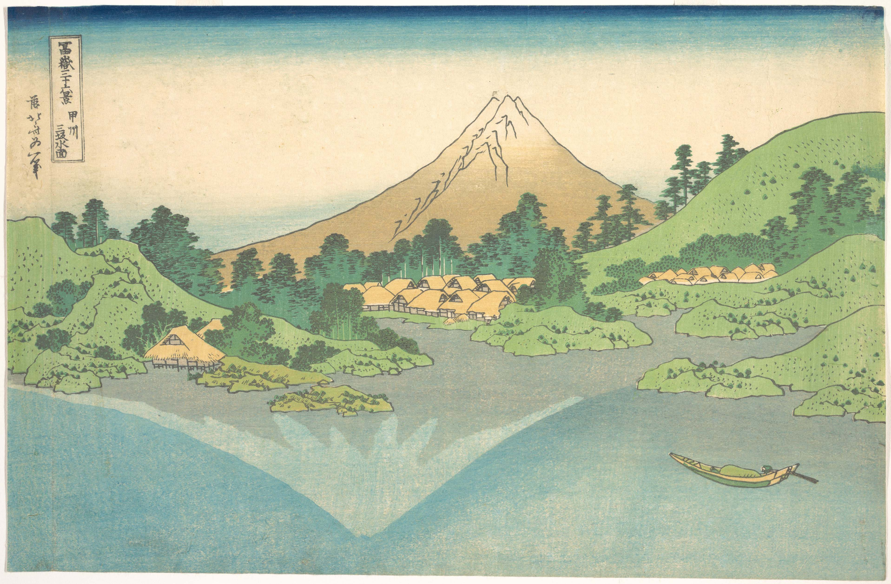

Работа изображает одну из популярных тем искусства укиё-э XIX века и один из самых устойчивых символов японской культуры — гору Фудзи. На отпечатке Фудзи творчески отражается в озере внизу, в спокойной сцене, играющей на движении света, облаков и воды. Это зеркальное отражение создаёт необычную игру фантазии и реальности, где голая, треснувшая и зазубренная вершина реальной Фудзи контрастирует с более романтичным, покрытым снегом изображением в отражении.

## 26. Hodogaya on the Tōkaidō

Варианты названия:

- *"Ходогая на Токайдо"*
- *"Hodogaya on the Tokaido"*
- *"Tōkaidō Hodogaya"*

В этой работе Хокусай изображает путешественников по Токайдо, проходящих через станцию Ходогая. Почти все направляются на запад, выглядя уставшими от подъёма на холм Гонта-дзака. Слева паланкинщики отдыхают, справа — одинокий пешеход, одетый в традиционную одежду буддийского монаха, смотрит на вырезанное в скале религиозное изображение. Центр композиции занимает гора Фудзи, но именно на переднем плане Хокусай использует свою образность, чтобы бросить вызов зрителю. Всадник на лошади и человек, ведущий лошадь, кажутся созерцающими сцену. Цвета одежды путешественников гармонируют с природой, а группы сосновых иголок отражают форму горы.

## 27. Tama River in Musashi Province

Варианты названия:

- *"Река Тама в провинции Мусаси"*
- *"Tama River in Musashi Province"*
- *"Musashi Tamagawa"*

На отпечатке раскрывается красота японских пейзажей: реки, заснеженные горы и живописные виды. Поздние отпечатки, посвящённые той же теме, показывали образ жизни людей, включая развитие провинции Мусаси и человеческую деятельность.

## 28. Asakusa Hongan-ji Temple in the Eastern Capital (Edo)

Варианты названия:

- *"Храм Асакуса Хонган-дзи в восточной столице (Эдо)"*
- *"Asakusa Hongan-ji temple in the Eastern capital [Edo]"*
- *"Tōto Asakusa Hongan-ji"*

Асакуса был самым населённым районом в Эдо во времена Хокусая. Его улицы были заполнены магазинами, где оживлённо торговали купцы и ремесленники. Одной из достопримечательностей был храм Асакуса Хонган-дзи, построенный в 1657 году. В композиции Хокусай приблизил здание храма так, что видна только вершина крыши, а над ней — гора Фудзи, повторяющая форму крыши. На крыше рабочие заняты ремонтом, их позы взяты из альбомов эскизов «Manga». Воздушный змей указывает на зиму, скорее всего, Новый год.

## 29. Tsukuda Island in Musashi Province

Варианты названия:

- *"Остров Цукуда в провинции Мусаси"*
- *"Tsukuda Island in Musashi Province"*
- *"Musashi Tsukuda-jima"*

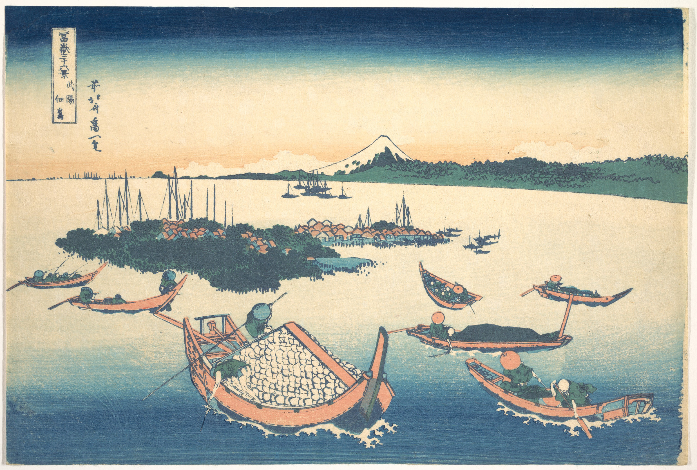

На гравюре изображены лодки вокруг острова Цукуда. Рыбаки за работой, вдали — зелёные горы с белыми вершинами. Богатые, простые цвета сочетаются со сложной композицией.

## 30. Shichiri Beach in Sagami Province

Варианты названия:

- *"Пляж Сичири в провинции Сагами"*
- *"Shichiri beach in Sagami Province"*
- *"Sōshū Shichiri-ga-hama"*

Цвета традиционно японские. Искусство Хокусая показывает, как люди соединяются с природой в повседневной жизни. Он смешивал традиционные методы и западные, его работы вдохновляли таких художников, как Дега и Моне.

## 31. Umezawa in Sagami Province

Варианты названия:

- *"Умэзава в провинции Сагами"*
- *"Umezawa in Sagami Province"*
- *"Sōshū Umezawa"*

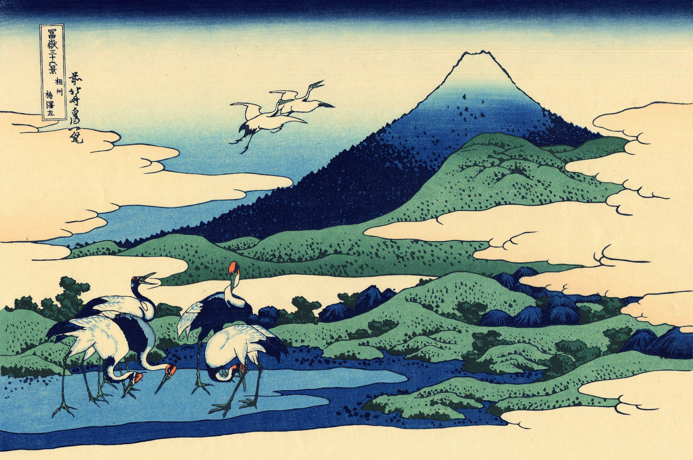

Умэзава — место у подножия Фудзи. Хокусай добавил пятерых птиц в пейзаж, чтобы завершить изображение. Туман и розовые цвета символизируют рассвет, а гора Фудзи и журавль — удачу.

## 32. Kajikazawa in Kai Province

Варианты названия:

- *"Кадзикадзава в провинции Каи"*
- *"Kajikazawa in Kai Province"*
- *"Kōshū Kajikazawa"*

Изображён человек, стоящий на скале, вытаскивающий сеть, и мальчик с корзиной рыбы. Хотя кажется, что это море, на самом деле это река Фудзи. Контраст между неподвижным рыбаком и бурной водой подчёркивает динамику сцены.

## 33. Mishima Pass in Kai Province

Варианты названия:

- *"Перевал Мисима в провинции Каи"*
- *"Mishima Pass in Kai Province"*
- *"Kōshū Mishima-goe"*

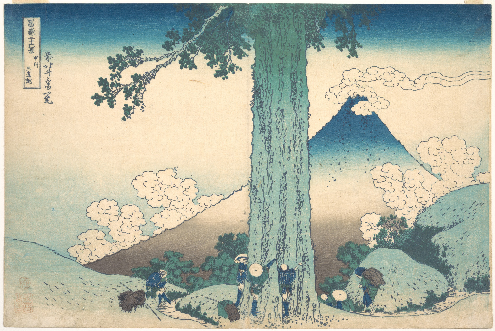

Трое путешественников обнимают древний кедр на перевале Мисима. Хокусай проявляет эмпатию к паломникам, изображая маленьких людей у огромного дерева. Гора Фудзи видна на заднем плане.

## 34. Mount Fuji from the Mountains of Totomi

Варианты названия:

- *"Гора Фудзи с гор Тотоми"*
- *"Mount Fuji from the mountains of Totomi"*
- *"Tōtōmi sanchū"*

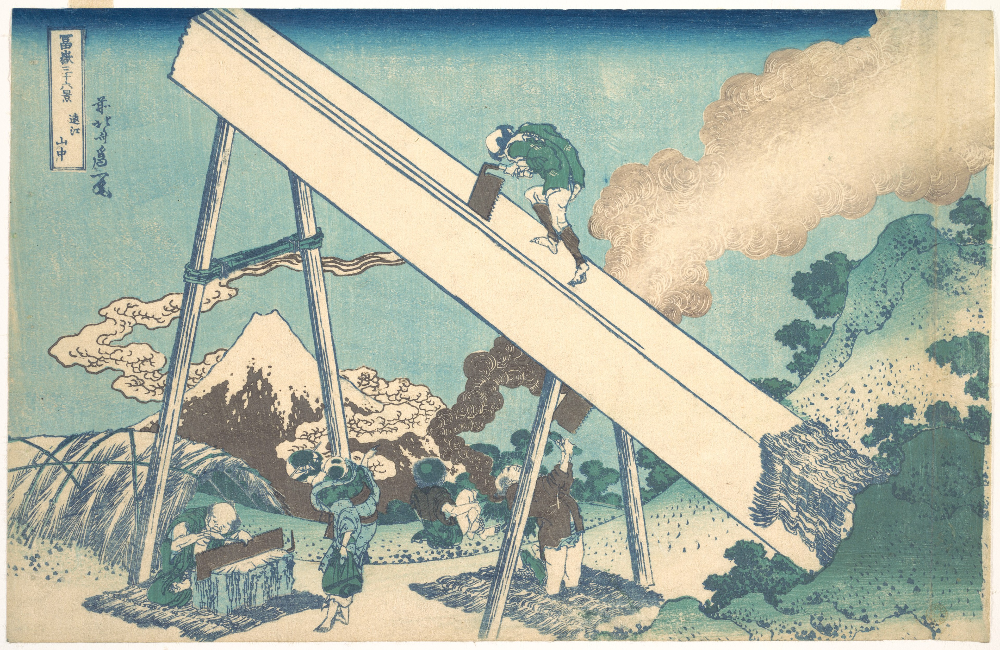

Гора Фудзи изображена с гор Тотоми. Для печати использовалась ксилография; цвет на бумаге в период Эдо.

## 35. A View of Mount Fuji Across Lake Suwa (Lake Suwa in Shinano Province)

Варианты названия:

- *"Вид на гору Фудзи через озеро Сува (озеро Сува в провинции Синано)"*
- *"A View of Mount Fuji Across Lake Suwa"*
- *"Shinano Suwa-ko"*

Озеро Сува изображено сверху с едва видимой Фудзи на горизонте. В центре — хижина на холме, слева лодка направляется к деревне.

## 36. Ushibori in Hitachi Province

Варианты названия:

- *"Усибори в провинции Хитати"*
- *"Ushibori in Hitachi Province"*
- *"Jōshū Ushibori"*

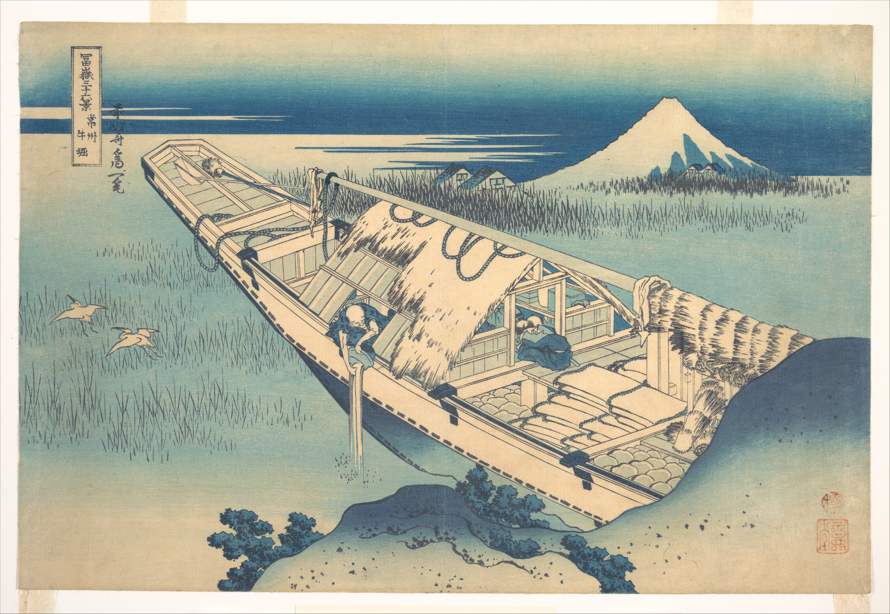

Произведение изображает традиционный образ жизни рыбаков вокруг Фудзи. Это пример того, как Хокусай стал изображать не только высшие слои общества, но и повседневную жизнь простых людей.
